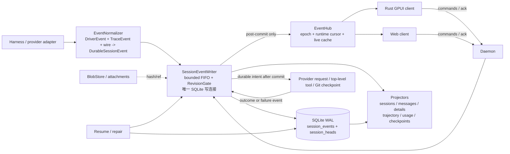

# WakuWaku 会话持久化重构计划

> **状态**：设计定稿，待分阶段实现  
> **范围**：Rust GPUI coding-agent client、daemon、Web client 共用的 session persistence 与 runtime event 链路。  
> **既定方向**：单一 SQLite 权威事件日志 + 可重建投影 + 副作用前落盘（fail-closed）。  
> **证据约定**：现有代码引用使用 `file:line`；参考项目使用 `temp/<repo>/path:line`。行号对应本次调研读取的工作树。本文只写设计与实施计划，不改变 provider wire protocol、UI 交互或工作区语义。

## 目录

1. [背景与问题](#1-背景与问题)
2. [目标与非目标](#2-目标与非目标)
3. [参考决策表](#3-参考决策表)
4. [目标架构](#4-目标架构)
5. [与现有组件的映射](#5-与现有组件的映射)
6. [实施阶段](#6-实施阶段)
7. [风险与缓解](#7-风险与缓解)
8. [测试策略](#8-测试策略)
9. [开放问题](#9-开放问题)

## 1. 背景与问题

### 1.1 现状结论

当前 session 的事实不是一份可重放的日志，而是五种状态的组合：`StateStore` 的 SQLite session projection、独立连接上的 `TrajectoryWriter` 三表、`snapshots/<session_id>.json`、Git checkpoint refs，以及客户端内存/React Query 副本和进程内 `EventHub` journal。`StateStore` 与 `TrajectoryWriter` 分别持有自己的连接和串行化机制，snapshot 与 Git 又不在 SQLite 事务内；`TurnFinished` 只能按代码顺序调用这些写入，不能形成全局原子提交（`crates/wakuwaku-core/src/persistence.rs:819-891,1375-1548`; `crates/wakuwaku-core/src/trajectory_store.rs:172-210,469-733`; `crates/wakuwaku-core/src/daemon.rs:1161-1190`）。

当前有八张业务表：`projects`、`sessions`、`messages`、`session_details`、`usage_events`、`trajectory_sessions`、`trajectory_prompt_snapshots`、`trajectory_records`；字段和外键关系见 `db/schema.ts:25-200`，迁移由每条 SQLite 连接独立执行（`crates/wakuwaku-core/src/persistence.rs:762-802`）。这八张表都是投影或账本，没有一张表保存“事件发生的唯一顺序”以及可重建的完整输入。

事件也有三套未闭合词汇：harness 的 `AgentEvent`/`TraceEvent`，daemon/protocol 的 `DriverEvent`/`WireDriverEvent`，以及 desktop/Web 各自的 reducer 输入和状态字段。`TraceEvent` 明确是 in-process only，不能直接进入 wire；同一次 provider 运行因此必须经过 `TraceHandoff → DriveRecorder → TrajectoryOp` 和 `DriverEvent → wire → reducer` 两条轨道（`crates/wakuwaku-harness/src/events.rs:1-140`; `crates/wakuwaku-core/src/trajectory.rs:314-543,623-1035`; `crates/wakuwaku-protocol/src/model.rs:1013-1081`; `crates/wakuwaku-protocol/src/driver_wire.rs:22-197`）。

### 1.2 现状审计确认的 12 条结构性问题

以下编号与现状审计的“已证实的结构性问题”一一对应（`temp/research/wakuwaku-current-state.md:388-412`）。前四项是本次重构必须首先消除的主因，其余是必须保留或显式迁移的边界。

1. **没有全局原子提交。** `StateStore`、`TrajectoryWriter`、snapshot 文件和 Git ref 分属不同 writer/介质；一处成功不能回滚其他处。因此会出现 session projection 已更新而 trajectory、snapshot 或 ref 落后的组合（`crates/wakuwaku-core/src/persistence.rs:819-891,1375-1548`; `crates/wakuwaku-core/src/trajectory_store.rs:172-210,469-733`; `crates/wakuwaku-core/src/daemon.rs:1161-1190`）。
2. **provider-started turn 存在 crash brick。** snapshot 通常只在 `TurnFinished`、close 或 shutdown 保存；而 `session_requires_stored_snapshot` 只要看到 `provider_turn_started` 就要求可恢复 snapshot。daemon 在 provider 已开始、`TurnFinished` 前崩溃时，projection/trajectory 可能有前缀，但 continuation snapshot 不在磁盘，重启会返回 `missing_harness_snapshot`（`crates/wakuwaku-core/src/daemon.rs:748-810,1083-1110,1259-1261`; `crates/wakuwaku-core/src/persistence.rs:906-960`; `temp/research/wakuwaku-current-state.md:159-167`）。
3. **Trace 丢失是静默的 backpressure 降级。** `TraceHandoff` 采用有界 `try_send`，队列满时不阻塞 provider，而是丢弃 trace command；UI DriverEvent 轨道可以继续，trajectory 却成为 partial/error（`crates/wakuwaku-core/src/trajectory.rs:314-385,437-461`; `temp/research/wakuwaku-current-state.md:173-176`）。
4. **EventHub replay 不是 durable replay。** journal 只存在内存且每 runtime 上限为 4096；daemon crash、restart 或超过窗口后，`runtime_event_cursor` 只能去重，不能重建 transcript（`crates/wakuwaku-core/src/server.rs:96-123,207-317`; `crates/wakuwaku-protocol/src/model.rs:389-400`; `temp/research/wakuwaku-current-state.md:178-180`）。
5. **`runtime_event_cursor` 依赖客户端回写。** daemon forward 路径并不把每个 wire sequence 直接写进 session projection，客户端必须先 reducer、再 `SaveTaskState`；在两步之间断线时持久 cursor 可能落后实际应用进度（`crates/wakuwaku-core/src/daemon.rs:1161-1190`; `crates/wakuwaku-client/src/persistence.rs:821-868`; `apps/web/src/lib/event-reducer.ts:49-68`）。
6. **fork/rewind 允许 Git 与数据库分叉。** fork/rewind 的 ref copy/restore、snapshot/save、trajectory mutation 不在一项事务内，Git warning 还可能被降级为 `cleanup_warning`，最终留下“turn 声称有 checkpoint、ref 实际不存在”的状态（`crates/wakuwaku-core/src/daemon.rs:963-1081`; `crates/wakuwaku-core/src/checkpoint.rs:342-497`）。
7. **desktop 与 Web 的 checkpoint 起点不一致。** desktop 在 provider start 前捕获 `turn-start`，Web 当前主要在 settle 后捕获结束 checkpoint；同一个 daemon session 由不同 client 启动时，rewind 基线可能不同（`src/app/runtime.rs:164-190,782-938`; `apps/web/src/lib/runtime-context.tsx:346-403`）。
8. **`usage_events` 是不可回滚事实，却不在 turn 事务中。** usage 使用 `event_id` 去重并在 session 删除、fork、rewind 后保留，这是计费正确性要求；但它目前与 session/trajectory/snapshot 分开提交，导致“已计费但 turn 尚未结束”的窗口（`db/schema.ts:101-120`; `crates/wakuwaku-core/src/persistence.rs:969-999`; `crates/wakuwaku-core/src/daemon.rs:1161-1190`）。
9. **snapshot 的 `tmp + rename` 不是全局 durable flush。** 文件替换能避免半个 JSON 可见，但 writer 没有与目录 `fsync` 配对，也没有和 SQLite/Git 组成提交边界（`crates/wakuwaku-core/src/persistence.rs:1686-1733`; `crates/wakuwaku-client/src/persistence.rs:929-948`）。
10. **trajectory detail 的安全边界不能随日志重构丢失。** detail projection 会过滤 `signature`、`api_key`、`password`、secret header、base64 和 host path，并限制 48 MiB/UTF-8 边界；把 canonical event payload 原样广播会绕过这层保护（`crates/wakuwaku-core/src/trajectory_detail.rs:28-101,388-417,506-591`）。
11. **存在未编译的重复 trajectory client stub。** `crates/wakuwaku-client/src/lib.rs:7-24` 只导出 `trajectory_client`，而 `crates/wakuwaku-client/src/trajectory.rs:16-38` 是不会参与编译的占位实现，容易误导后续维护者把它当成第二个客户端实现（`crates/wakuwaku-client/src/trajectory_client.rs:20-96`）。
12. **Rust 与 Web reducer 不是同构投影。** protocol 有 `BackgroundWork`、`SteerAccepted`、`SteerRejected`，desktop reducer 有对应分支，Web reducer 落入 `default` 只推进 cursor；同一 wire event 因而产生不同 `AgentSession`（`crates/wakuwaku-protocol/src/model.rs:1033-1059`; `src/app/streaming.rs:297-409`; `apps/web/src/lib/event-reducer.ts:65-212`）。

### 1.3 重构必须解决的四个根因

- **崩溃砖死**：把“provider 已开始但 continuation 不可恢复”改为“最后一个已提交 durable boundary 可恢复；开放 turn 在 resume 时由 repair 变成明确的 interrupted/retry 状态”。
- **双写者竞态**：把现有 `TrajectoryWriter` 的 FIFO、单线程连接和 `RevisionGate` 泛化为唯一 session event writer；任何 session/trajectory/usage 写入都经过它的一个 SQLite transaction。现有 writer 已证明 FIFO 和 commit barrier 可行（`crates/wakuwaku-core/src/trajectory_store.rs:63-165,172-333`）。
- **三套词汇表**：将 `AgentEvent`、`TraceEvent`、`DriverEvent`/wire 收敛为一个 durable event kind 集合；delta 只作为 live delivery，`Ended`/`Finished` 才是恢复边界，保留 UI-specific projection 而不保留 UI-specific authority（`temp/opencode/packages/schema/src/session-event.ts:187-195,226-234`; `temp/research/wakuwaku-current-state.md:74-108`）。
- **legacy 回填阶梯**：snapshot → trajectory 的现有 `Snapshot`、`LegacyPartialMissingSnapshot`、`Empty` 三态回填在 `ensure_trajectory_initialized` 中发生，且 file-only 读取是为了避免 live cache 污染历史（`crates/wakuwaku-core/src/daemon.rs:1193-1221`; `crates/wakuwaku-core/src/trajectory_store.rs:423-466`）。新系统用一次性、可重入的 snapshot/event importer 代替每次启动的 legacy backfill；旧源在影子校验完成前不删除。

## 2. 目标与非目标

### 2.1 可度量目标

| 目标 | 验收口径 |
|---|---|
| **provider-started 会话可 resume** | 在 provider start 之后、任意 durable/非 durable crash failpoint kill daemon，重启后不再因 `missing_harness_snapshot` 砖死；至少能 hydrate 到最后完整 `Ended`/`Finished` 边界，并将开放 turn repair 为 `interrupted` 或可明确重试的 intent。对 provider 自有 opaque cursor 失效，必须返回显式 retry 状态，不能伪造空上下文。 |
| **单一 SQLite 事务边界** | 每个 accepted command 的 `session_events` append、`session_heads` 更新、`sessions/messages/session_details`、trajectory 三表和 `usage_events` 投影全部在同一个 `BEGIN IMMEDIATE` transaction；任一 projector 失败时事件和所有投影均不可见。 |
| **单一顺序/单一真相** | 对每个 event stream，`(session_id, seq)` 连续且单调；`session_heads.head_seq` 是最后已提交边界；任何 projection 删除后都能从 event prefix 重建到同一 digest。 |
| **live 与 hydrate 使用同一词汇** | daemon live broadcast、Rust desktop reducer、Web reducer 和 restart hydrate 都消费同一 versioned `DurableSessionEvent` envelope；客户端的 `runtime_event_cursor` 只做 live ack，不再决定恢复内容。 |
| **副作用 fail-closed** | provider request dispatch、首 token 前的 continuation 边界以及顶层 tool execution 前，都先 append intent 并等待 commit ack；flush/transaction 失败时不得调用下游 provider/tool。这个边界沿用 DeepSeek checkpoint policy 的语义（`temp/deepseek-harness/packages/session/session-checkpoint-policy/src/index.ts:63-82`），但不引入其 200ms write-behind。 |
| **trace 不静默丢失** | writer queue 满、连接断或 projector 失败时返回 error/NACK 并停止该 turn 的后续副作用；禁止继续运行后再把 trace 降级为 partial。 |
| **fork/rewind 可审计** | fork 的新 stream 只包含源 boundary 之前的 event prefix；rewind 采用 immutable replacement + conditional pointer cutover，旧 stream 不变；usage 不复制、不撤回，Git ref 与 event id 有可查询关联。 |
| **列表与大历史可控** | session list 仍只读轻量 projection，不随 transcript 大小线性反序列化；冷 hydrate 以 `head_seq`/可选 replay checkpoint 分段读取。首个实现的性能门槛为 10,000 durable events 冷 hydrate p95 ≤ 1 s（测试机、无 provider 网络），超过门槛必须启用 checkpoint/分页优化，而不是放宽一致性。现有 list/hydrate 分离的目的见 `crates/wakuwaku-core/src/persistence.rs:1222-1370`。 |
| **一次性迁移可回退** | 每个 legacy session 导入有独立状态、源 fingerprint 和 shadow digest；导入器可重跑，不删除原 snapshot/旧 projection，直到新旧 digest 和恢复矩阵全部通过。 |

### 2.2 非目标

1. **不改 UI 交互。** session list、streaming layout、fork/rewind 按钮、permission UX 和 GPUI rendering cadence 不在本计划内；`src/app/streaming.rs:212-600` 和 Web reducer 仍是 UI projection。
2. **不做多设备同步或 CRDT。** event log 只解决单 daemon、单写者、多个本地 client 的一致性；不引入远端合并、冲突解决或跨设备 ownership。
3. **不改变 provider 协议层。** OpenAI/Anthropic wire、auth、model catalog、provider adapter 的 HTTP 语义保持不变；只在调用前后增加 daemon-owned durable boundary。provider endpoint 现状和支持范围见 `docs/providers.md:3-6,37-47`。
4. **不把 app/UI/settings/draft/credentials 变成 session event。** `app.json`、`state.json`、`settings.json`、`composer-drafts.json`、credentials、model catalog 继续由各自 store 管理；它们不是 session transcript authority（`crates/wakuwaku-client/src/persistence.rs:622-695,821-868`; `crates/wakuwaku-protocol/src/settings.rs:40-47`; `crates/wakuwaku-core/src/persistence.rs:103-176`）。
5. **第一阶段不实现新的 compaction 算法。** 先为 compaction 预留可重放 event 和 source hash；是否把摘要生成器纳入第一阶段留给开放问题。provider-native compaction 不能直接成为统一服务端 transcript（`temp/t3code/apps/server/src/provider/ProviderRuntimeIngestion.ts:744-759`; `temp/zed/crates/agent/src/thread.rs:192-215`）。
6. **不承诺硬件突然掉电下的 fsync 级别。** 第一版目标是进程 crash、线程异常、正常 SQLite WAL 恢复和显式 fail-closed；`synchronous=NORMAL` 的掉电强度若需要更高等级，单列为部署决策。当前连接已启用 WAL/`synchronous=NORMAL`/foreign keys（`crates/wakuwaku-core/src/persistence.rs:629-635`）。

## 3. 参考决策表

下表将四份参考分析中的结论转成 WakuWaku 的“抄什么/不抄什么”。参考项目不提供现成实现；所有差异都以 WakuWaku 的常驻 daemon、已有 SQLite 和跨客户端消费为约束。

| 决策 | 抄什么 | 为什么适合 WakuWaku | 明确不抄什么及原因 | 证据 |
|---|---|---|---|---|
| **权威层是 typed append log** | DeepSeek 的 append-only event log、OpenCode 的 event + projection、Codex 的 canonical item/replay | 事件是唯一顺序；projection 丢失可重建；resume、fork boundary、live replay 共享同一事实 | 不抄 DeepSeek 的 `format=0` 无升级链；不抄 OpenCode V1/V2 双会话路径，避免再造双轨 | `temp/deepseek-harness/packages/core/session/src/index.ts:425-441`; `temp/opencode/packages/core/src/event/sql.ts:8-24`; `temp/codex/codex-rs/thread-store/src/local/live_writer.rs:331-347`; `temp/deepseek-harness/packages/core/session/src/types.ts:56-89` |
| **选 SQLite event table，不选 JSONL canonical file** | OpenCode/T3 的 SQLite event + same-transaction projector；Goose 的 WAL、`BEGIN IMMEDIATE`、单连接/有序行 | daemon 已有 `app.db`、`rusqlite`、WAL 和 session/trajectory 查询；把 writer FIFO 复用到同一 connection，能在一次 SQLite transaction 同时 append + project + usage。跨平台路径、锁、备份和单文件部署也已经存在 | 不把 Codex JSONL 直接移植为第二个 canonical store。Codex 的 JSONL + SQLite projection 适合其本地 CLI rollout 文件与独立 thread-store；WakuWaku 若同时保留 JSONL、SQLite、snapshot 会保留三重事实。只借 Codex 的 replay、pending suffix retry、byte/ordinal boundary | 当前 SQLite writer 与连接配置：`crates/wakuwaku-core/src/persistence.rs:629-635,819-891`; trajectory 独立 SQLite writer：`crates/wakuwaku-core/src/trajectory_store.rs:172-210`; Codex rollout/projection 分层：`temp/codex/codex-rs/thread-store/src/local/live_writer.rs:283-347`; Goose SQLite 原子写：`temp/goose/crates/goose/src/session/session_manager.rs:902-907,1839-1931` |
| **单写者沿用 TrajectoryWriter 机制** | FIFO、`RevisionGate`、读操作等待 committed revision | 现有实现已有有界队列、writer thread、commit 后 live callback、read barrier；泛化它比另起 StateStore writer 更少竞态 | 不保留 `StateStore` 直接 session UPSERT 与 `TrajectoryWriter` 第二连接。所有 session、trajectory、usage 由同一 writer command 进入一个 transaction | `crates/wakuwaku-core/src/trajectory_store.rs:63-165,172-333,469-565`; `temp/pi/packages/session-backends/sqlite-node/src/sqlite/repo.ts:377-486` |
| **append + projection 同事务** | OpenCode 的 projector/commit hook/sequence/event insert 同一 SQLite immediate transaction；T3 的 accepted/result receipt 同事务 | 失败整体 rollback，外部读者永远只看到完整 event + 完整 projection；解决现有 `TurnFinished` 代码顺序不是原子提交的问题 | 不照搬 T3 的“provider context 只存 opaque cursor”作为 WakuWaku 唯一恢复材料；WakuWaku 还必须存完整 thinking signature、tool args、usage 和 harness continuation 边界 | `temp/opencode/packages/core/src/event.ts:238-353`; `temp/t3code/apps/server/src/orchestration/Layers/OrchestrationEngine.ts:186-217`; `temp/research/wakuwaku-current-state.md:390-394` |
| **delta live-only，Ended/Finished durable** | OpenCode 对 `PartDelta`/stream delta 与 `Text.Ended`、`Reasoning.Ended`、`Tool.Input.Ended` 的区分 | 降低 token 级写放大，又保证 hydrate 不会得到半个 assistant/tool payload；中途 crash 明确恢复到最后完整边界 | 不抄 Gemini/ Pi 逐行忽略坏尾的宽松语义；WakuWaku unknown kind 和已提交 event 必须 fail-closed | `temp/opencode/packages/schema/src/session-event.ts:187-195,226-234,300-309`; `temp/gemini-cli/packages/core/src/services/chatRecordingService.ts:559-573`; `temp/pi/packages/coding-agent/src/core/session-manager.ts:514-565` |
| **副作用前 flush** | DeepSeek checkpoint policy；Crush 在 stream 前写 user/空 assistant、结构性变化同步 flush、run 退出兜底 | provider/tool 前已有 intent，crash 后可以 repair，不会把“副作用已经发生但没有恢复材料”当成空 turn | 不抄 DeepSeek 默认 200ms write-behind queue。WakuWaku 是常驻 daemon，delta 本来 live-only，真正需要的是 intent 前的同步 transaction/flush；再加一层 200ms 队列会扩大可观测复杂度和 durable latency。需要时可在 writer 内对连续 terminal events 做同事务 batch，而不引入 write-behind authority | `temp/deepseek-harness/packages/session/session-checkpoint-policy/src/index.ts:63-82`; `temp/deepseek-harness/packages/session/session-persistence/src/write-behind.ts:31-95`; `temp/crush/internal/agent/agent.go:703-717,735-781`; `crates/wakuwaku-core/src/trajectory_store.rs:195-201` |
| **崩溃 repair 而不是空恢复** | DeepSeek 的 interrupted turn、未启动 tool、unknown result、step/end closer；Comet 的 stale run recovery | restart 时把开放结构变成显式 `interrupted`，事件仍可重放，后续 retry 有状态依据 | 不自动猜测 provider/tool 是否已执行；无 idempotency evidence 时只标记 `unknown`/`not_executed` 并等待明确 retry，避免副作用双跑 | `temp/deepseek-harness/packages/core/session/src/repair.ts:24-135`; `temp/deepseek-harness/packages/session/session-persistence/src/coordinator.ts:902-956`; `temp/comet/crates/engine/src/sessions.rs:586-651`; Goose 缺少副作用前 intent 的边界：`temp/goose/crates/goose/src/agents/agent.rs:2654-2704` |
| **fork 用 immutable prefix copy；rewind 用 replacement pointer** | Codex paginated fork 的 ordinal/byte boundary 与 immutable replacement + conditional cutover；Cline replacement session + Git restore rollback | fork 不修改父 stream；rewind 不删除审计事件，冲突可以用 expected head 检查拒绝；与 SQLite append-only 和 Git ref 关联更一致 | 不抄 Gemini 同文件 `$rewindTo` 作为唯一 rewind 机制，也不抄当前 WakuWaku 的原地 DELETE trajectory records；同文件回退在并发/审计上需要更多隐含状态 | `temp/codex/codex-rs/thread-store/src/local/paginated_fork.rs:87-178`; `temp/codex/codex-rs/thread-store/src/local/revert_thread.rs:91-122`; `temp/cline/sdk/packages/core/src/session/session-versioning-service.ts:191-326`; `crates/wakuwaku-core/src/trajectory_store.rs:836-880` |
| **display、LLM、canonical 三层 projection** | DeepSeek surface/origin、Goose audience metadata、Zed replay/to_request、Cline display/message builder | UI 可清洗和折叠，provider 可按预算和能力重建，canonical log 保留全审计内容 | 不让 desktop/Web 的 `AgentSession` 回写成为 daemon truth；不把 UI display wrapper 直接送给 provider | `temp/deepseek-harness/packages/core/session/src/surface.ts:48-74,158-212`; `temp/goose/crates/goose-provider-types/src/conversation/message.rs:783-985`; `temp/zed/crates/agent/src/thread.rs:1512-1565,4833-4900`; `temp/cline/sdk/packages/core/src/session/display-messages.ts:105-117` |
| **版本守卫与显式迁移链** | OpenCode migration journal、Goose version loop、Codex staged/pending legacy migration、Zed legacy version guard | schema migration 与 event schema 分离；导入可中断后重启，不会把不认识的 payload 变成空历史 | 不抄 Gemini 无顶层 ConversationRecord version、Cline messages reader 解析失败返回空数组、DeepSeek v0 没有 upgrade chain | `temp/opencode/packages/core/src/database/migration.ts:28-92`; `temp/goose/crates/goose/src/session/session_manager.rs:1205-1261`; `temp/codex/codex-rs/thread-store/src/local/rollout_migration.rs:1-9`; `temp/zed/crates/agent/src/db.rs:195-207`; `temp/cline/sdk/packages/core/src/runtime/host/runtime-host-support.ts:53-74` |
| **保留 GPUI 退出 flush 与 compaction marker** | Zed observe-triggered save/quit flush、compaction marker | 作为 client graceful shutdown 的加速与 UI replay 辅助；但 authority 仍在 daemon event log | 不把 Zed 的整行 snapshot 覆盖保存当作 crash barrier；`Thread::send` 不等待 save，不能满足 provider/tool 前 intent | `temp/zed/crates/agent/src/agent.rs:817-823,1736-1823`; `temp/zed/crates/agent/src/thread.rs:2503-2538`; `temp/research/wakuwaku-current-state.md:159-167` |

### 3.1 为什么不是 JSONL

Codex 的实现证明 JSONL 很适合本地、单进程/单用户 CLI：rollout 文件是 canonical，SQLite 只为分页和过滤保存可重建 projection，writer 还需要维护文件 suffix、byte offset 和 pending retry（`temp/codex/codex-rs/rollout/src/recorder.rs:953-1007,1631-1726`; `temp/codex/codex-rs/thread-store/src/local/thread_history.rs:99-208`）。这不是 JSONL 不可靠，而是它把“文件 writer、SQLite projector、路径迁移”拆成多个 durability 层。

参考仓库清单确认本次保留的 13 个仓库均为有效且活跃的 checkout，持久化形态同时覆盖 JSONL、SQLite、snapshot 和 journal；因此下表按“可迁移的机制”而不是按项目流行度取舍（`temp/research/reference-inventory.md:3-25,180-182`）。

WakuWaku 已经有 daemon-owned SQLite、WAL、migration runner 和 `TrajectoryWriter` 的单写线程；当前双连接的缺陷恰好是写者没有复用同一事务，而不是缺少文件格式（`crates/wakuwaku-core/src/persistence.rs:773-802,819-891`; `crates/wakuwaku-core/src/trajectory_store.rs:184-210`）。选择 SQLite event table 后，append、projection、usage、head revision 都能在 `BEGIN IMMEDIATE` 中提交，跨平台路径、备份和 crash recovery 只需维护一份数据库。大 payload 仍可由现有 content-addressed `BlobStore` 外置，event payload 保存 hash/ref，不需要把完整 blob 塞进单个 SQLite row（`crates/wakuwaku-core/src/blob_store.rs:96-186`）。

### 3.2 为什么不是 DeepSeek 的 200ms write-behind

DeepSeek 的 write-behind 主要优化“事件 append 不阻塞热路径”，并用显式 `flush` 作为 barrier（`temp/deepseek-harness/packages/session/session-persistence/src/write-behind.ts:31-95`）。WakuWaku 的 streaming delta 在设计上已经是 live-only；需要 durable 的只有 prompt、provider/tool intent、Ended/Result/Finished 等结构性边界。常驻 daemon 可以让单 writer 直接执行一项短 SQLite transaction，再在副作用前等待 ack；这比维护“内存队列 → flush queue → SQLite projection”的第三条轨道更容易证明 fail-closed。

这不是禁止批处理：同一 turn 内已经完成的多个 terminal event 可以在一个 writer command 中批量 append。禁止的是在 intent 已被接受后、没有 durable ack 的情况下继续 provider/tool；队列满应 backpressure 或返回错误，而不是像当前 `TraceHandoff::try_send` 那样静默丢失。

## 4. 目标架构

### 4.1 核心不变量

1. **一个 writer。** daemon 内所有 session event、projection、trajectory、usage command 进入同一个 bounded FIFO；只允许 writer thread 持有写连接。现有 `TrajectoryWriter` 的 `writer_loop`、`RevisionGate` 和 commit 后 live callback 是保留基线（`crates/wakuwaku-core/src/trajectory_store.rs:361-420,469-510`）。
2. **一个 append transaction。** writer 在 `BEGIN IMMEDIATE` 中读取 `session_heads`，校验 expected head/command id/schema/kind，给每个 event 分配连续 `seq`，写 `session_events`，运行所有 projector，更新 head/revision，然后 commit。投影失败整体 rollback；commit 后才能发布 wire/live update。
3. **event log + head 是唯一真相。** `sessions`、`messages`、`session_details`、trajectory 三表和 `usage_events` 都可删除后重建。`session_heads` 保存当前 stream/head/revision/generation，是并发条件检查和恢复边界；client projection 不再反向决定 daemon 的历史。
4. **live 与 durable 分层。** `TextDelta`、`ReasoningDelta`、tool input partial 等只进入 EventHub live path；`assistant_message_ended`、`tool_call_ended`、`tool_result_recorded`、`turn_finished` 等完整值进入 SQLite。OpenCode 已验证这种“delta live-only、Ended replay boundary”语义（`temp/opencode/packages/core/src/session/runner/publish-llm-event.ts:137-193`; `temp/opencode/packages/schema/src/session-event.ts:187-195,226-234`）。
5. **副作用前意图。** provider 请求、顶层 tool、Git checkpoint 等外部动作都先写 intent event 并 flush；失败则动作不执行。动作结果再写 outcome event；resume repair 只依据 intent/outcome 的组合决定 `completed`、`not_executed` 或 `unknown`。
6. **未知类型拒绝解释。** `schema_version` 和 `kind` 在 append/replay 前用严格 enum 解码；不认识的 durable kind、未知 schema version 或 payload shape 不得静默跳过。未来若引入可忽略 event，必须显式定义 projector-neutral 的 `ignorable` contract，并不能让当前版本把它当 session state。
7. **外部副作用不是 SQLite 原子事务的一部分。** Git ref、provider HTTP 和 tool process 不能回滚；SQLite 事务只保证 intent/outcome 事实。失败通过 `workspace_checkpointed`/`session_repaired` 等事件和补偿动作收敛，不能把“事务 commit”误写成“外部动作已成功”。

### 4.2 组件图



`EventHub` 仍负责 runtime isolation、epoch、client cursor 和低延迟 live delivery，但 journal 只作为 cache；跨 crash 的 replay 从 `session_events` 的 durable seq 读取。现有 EventHub 的 epoch/sequence/late-runtime 隔离应保留（`crates/wakuwaku-core/src/server.rs:96-123,172-183,207-317`）。

### 4.3 一次 turn 的写入时序

```mermaid
sequenceDiagram
    autonumber
    participant UI as Rust/Web client
    participant D as Daemon
    participant W as SessionEventWriter
    participant DB as SQLite WAL
    participant P as Provider
    participant X as Tool
    participant G as Git

    UI->>D: prompt command(command_id)
    D->>W: append prompt_admitted + session_lifecycle
    W->>DB: BEGIN IMMEDIATE; insert events; project messages/turns; update head
    DB-->>W: COMMIT(seq=n, revision=r)
    W-->>D: durable ack(seq=n)
    D-->>UI: accepted + live turnStarted

    D->>W: append context_prepared + provider_request_started
    W->>DB: COMMIT(seq=n+1..n+2)
    W-->>D: flush ack
    D->>P: dispatch provider request
    P-->>D: TextDelta/ReasoningDelta (live-only)
    D-->>UI: live deltas; no SQLite event per delta
    P-->>D: assistant end + thinking signature
    D->>W: append assistant_message_ended
    W->>DB: COMMIT(seq=n+3); project message/trajectory
    W-->>D: committed revision

    D->>W: append tool_call_ended(args + idempotency key)
    W->>DB: COMMIT(seq=n+4)
    W-->>D: flush ack
    D->>X: execute top-level tool
    X-->>D: result/error
    D->>W: append tool_result_recorded
    W->>DB: COMMIT(seq=n+5); project trajectory
    W-->>D: committed revision

    P-->>D: usage / finished
    D->>W: append usage_recorded + turn_finished
    W->>DB: one COMMIT(seq=n+6..n+7); update usage/session/details
    W-->>D: durable ack
    D->>G: post-commit checkpoint outcome when requested
    D-->>UI: turnFinished only after DB commit
```

若 daemon 在 `provider_request_started` commit 后、provider 返回前崩溃，resume 看到的是已落盘 intent，而不是空 session；repair 追加 `session_repaired`，将未闭合 turn 标成 interrupted。若在 tool intent commit 后崩溃，repair 不能假设 tool 已执行；只有带相同 idempotency key 的可验证 result 才能标为 completed。

### 4.4 Target SQLite DDL

下面是目标 schema 的完整核心 DDL。`session_events.session_id` 在物理层表示不可变 event stream id；用户可见的稳定 session id 是 `session_heads.logical_session_id`，这样 immutable replacement 可以切换 stream 而不删除旧审计历史。普通 session 创建时两者初始相同。`session_streams`/`session_heads` 是 head/lineage 元数据，不取代 event log；真正的状态仍由 event prefix 决定。

```sql
PRAGMA foreign_keys = ON;

CREATE TABLE projects (
    id          TEXT PRIMARY KEY,
    name        TEXT NOT NULL,
    path        TEXT NOT NULL,
    position    INTEGER NOT NULL,
    created_at  INTEGER NOT NULL
);

CREATE TABLE sessions (
    id              TEXT PRIMARY KEY,
    project_id      TEXT NOT NULL REFERENCES projects(id),
    title           TEXT NOT NULL,
    auto_title      TEXT,
    provider        TEXT NOT NULL,
    model           TEXT,
    status          TEXT NOT NULL,
    created_at      INTEGER NOT NULL,
    updated_at      INTEGER NOT NULL,
    last_reply_at   INTEGER,
    deleted_at_ms   INTEGER,
    projection_seq  INTEGER NOT NULL DEFAULT 0
);

CREATE TABLE session_streams (
    stream_id           TEXT PRIMARY KEY,
    logical_session_id  TEXT NOT NULL REFERENCES sessions(id),
    parent_stream_id    TEXT REFERENCES session_streams(stream_id),
    parent_seq          INTEGER,
    created_at_ms       INTEGER NOT NULL,
    closed_at_ms        INTEGER,
    state               TEXT NOT NULL DEFAULT 'active',
    CHECK (parent_seq IS NULL OR parent_seq >= 0)
);

CREATE TABLE session_heads (
    logical_session_id  TEXT PRIMARY KEY REFERENCES sessions(id),
    stream_id           TEXT NOT NULL UNIQUE REFERENCES session_streams(stream_id),
    head_seq            INTEGER NOT NULL DEFAULT 0,
    generation          INTEGER NOT NULL DEFAULT 1,
    revision            INTEGER NOT NULL DEFAULT 0,
    schema_version     INTEGER NOT NULL,
    last_event_id      TEXT,
    updated_at_ms       INTEGER NOT NULL,
    CHECK (head_seq >= 0),
    CHECK (generation > 0),
    CHECK (revision >= 0),
    CHECK (schema_version > 0)
);

CREATE TABLE session_events (
    session_id      TEXT NOT NULL REFERENCES session_streams(stream_id),
    seq             INTEGER NOT NULL,
    event_id        TEXT NOT NULL UNIQUE,
    command_id      TEXT,
    schema_version  INTEGER NOT NULL,
    kind            TEXT NOT NULL,
    payload_json    TEXT NOT NULL CHECK (json_valid(payload_json)),
    created_at_ms   INTEGER NOT NULL,
    runtime_id      TEXT,
    turn_id         TEXT,
    PRIMARY KEY (session_id, seq),
    UNIQUE (session_id, command_id),
    CHECK (seq > 0),
    CHECK (schema_version > 0),
    CHECK (length(kind) > 0)
);

CREATE TABLE messages (
    id               TEXT PRIMARY KEY,
    session_id       TEXT NOT NULL REFERENCES sessions(id),
    turn_id          TEXT,
    position         INTEGER NOT NULL,
    source_seq       INTEGER NOT NULL,
    role             TEXT NOT NULL,
    content          TEXT NOT NULL,
    display_content  TEXT,
    attachments      TEXT NOT NULL DEFAULT '[]' CHECK (json_valid(attachments)),
    created_at       INTEGER NOT NULL,
    streaming        INTEGER NOT NULL CHECK (streaming IN (0, 1)),
    UNIQUE (session_id, position)
);

CREATE TABLE session_details (
    session_id       TEXT PRIMARY KEY REFERENCES sessions(id),
    schema_version   INTEGER NOT NULL,
    last_event_seq   INTEGER NOT NULL,
    data             TEXT NOT NULL CHECK (json_valid(data)),
    CHECK (last_event_seq >= 0),
    CHECK (schema_version > 0)
);

CREATE TABLE usage_events (
    event_id         TEXT PRIMARY KEY,
    session_id       TEXT NOT NULL,
    source_event_id  TEXT NOT NULL UNIQUE,
    project_path     TEXT NOT NULL,
    provider         TEXT NOT NULL,
    model            TEXT NOT NULL,
    timestamp_ms     INTEGER NOT NULL,
    input            INTEGER NOT NULL,
    output           INTEGER NOT NULL,
    cache_read       INTEGER NOT NULL,
    cache_write      INTEGER NOT NULL,
    reasoning        INTEGER,
    CHECK (input >= 0),
    CHECK (output >= 0),
    CHECK (cache_read >= 0),
    CHECK (cache_write >= 0),
    CHECK (reasoning IS NULL OR reasoning >= 0)
);

CREATE TABLE trajectory_sessions (
    session_id       TEXT PRIMARY KEY REFERENCES sessions(id),
    schema_version   INTEGER NOT NULL,
    generation       INTEGER NOT NULL,
    revision         INTEGER NOT NULL,
    next_sequence    INTEGER NOT NULL,
    availability     TEXT NOT NULL
);

CREATE TABLE trajectory_prompt_snapshots (
    session_id       TEXT NOT NULL REFERENCES trajectory_sessions(session_id),
    prompt_id        TEXT NOT NULL,
    source_seq       INTEGER NOT NULL,
    sequence         INTEGER NOT NULL,
    fingerprint      TEXT NOT NULL,
    system_prompt    TEXT,
    tools_json       TEXT NOT NULL CHECK (json_valid(tools_json)),
    options_json     TEXT NOT NULL CHECK (json_valid(options_json)),
    model_hint       TEXT NOT NULL,
    created_at_ms    INTEGER NOT NULL,
    PRIMARY KEY (session_id, prompt_id),
    UNIQUE (session_id, sequence)
);

CREATE TABLE trajectory_records (
    session_id        TEXT NOT NULL REFERENCES trajectory_sessions(session_id),
    record_id         TEXT NOT NULL,
    source_seq        INTEGER NOT NULL,
    sequence          INTEGER NOT NULL,
    revision          INTEGER NOT NULL,
    request_id        TEXT,
    parent_record_id  TEXT,
    prompt_id         TEXT,
    turn_count        INTEGER NOT NULL,
    step              INTEGER NOT NULL,
    kind              TEXT NOT NULL,
    lane              TEXT NOT NULL,
    status            TEXT NOT NULL,
    title             TEXT NOT NULL,
    preview           TEXT NOT NULL,
    search_text       TEXT NOT NULL,
    started_at_ms     INTEGER,
    first_token_at_ms INTEGER,
    completed_at_ms   INTEGER,
    duration_ms       INTEGER,
    ttft_ms           INTEGER,
    detail_json       TEXT NOT NULL CHECK (json_valid(detail_json)),
    PRIMARY KEY (session_id, record_id),
    UNIQUE (session_id, sequence)
);

CREATE TABLE session_checkpoints (
    checkpoint_id     TEXT PRIMARY KEY,
    session_id        TEXT NOT NULL REFERENCES sessions(id),
    source_event_id   TEXT NOT NULL UNIQUE,
    turn_id           TEXT,
    turn_count        INTEGER NOT NULL,
    role              TEXT NOT NULL,
    phase             TEXT NOT NULL,
    ref_name          TEXT NOT NULL,
    commit_oid        TEXT,
    status            TEXT NOT NULL,
    created_at_ms     INTEGER NOT NULL
);

CREATE TABLE session_imports (
    session_id          TEXT PRIMARY KEY REFERENCES sessions(id),
    source_kind         TEXT NOT NULL,
    source_path         TEXT,
    source_fingerprint  TEXT NOT NULL,
    state               TEXT NOT NULL,
    last_source_key     TEXT,
    imported_stream_id  TEXT,
    imported_head_seq  INTEGER,
    shadow_digest       TEXT,
    error               TEXT,
    updated_at_ms       INTEGER NOT NULL
);

CREATE TABLE migrations (
    tag         TEXT PRIMARY KEY,
    applied_at  INTEGER NOT NULL
);

CREATE INDEX sessions_by_project
    ON sessions(project_id, updated_at);
CREATE INDEX sessions_by_updated_at
    ON sessions(updated_at);
CREATE INDEX sessions_by_last_reply_at
    ON sessions(last_reply_at);
CREATE INDEX session_streams_by_logical
    ON session_streams(logical_session_id, created_at_ms);
CREATE INDEX session_events_by_stream_kind
    ON session_events(session_id, kind, seq);
CREATE INDEX session_events_by_turn
    ON session_events(session_id, turn_id, seq);
CREATE INDEX messages_by_session
    ON messages(session_id, position);
CREATE INDEX usage_events_by_time
    ON usage_events(timestamp_ms);
CREATE INDEX trajectory_prompts_by_sequence
    ON trajectory_prompt_snapshots(session_id, sequence);
CREATE INDEX trajectory_records_by_request
    ON trajectory_records(session_id, request_id);
CREATE INDEX trajectory_records_by_sequence
    ON trajectory_records(session_id, sequence);
CREATE INDEX checkpoints_by_session
    ON session_checkpoints(session_id, turn_count, created_at_ms);
```

实现注意：`UNIQUE(session_id, command_id)` 对 `NULL` command id 保持 SQLite 的多 NULL 语义；所有可重试 RPC 都必须提供 `command_id`。`session_heads.revision` 是持久化 read barrier，不等同于 EventHub 的 `(runtime_id, epoch, sequence)`；当前 trajectory 也已明确区分 `revision`、`generation`、row `next_sequence` 三种水位（`crates/wakuwaku-core/src/trajectory_store.rs:719-737,836-880`; `crates/wakuwaku-core/src/server.rs:207-317`）。

### 4.5 Durable event envelope 与词汇表

每一行的 envelope 由列和 payload 共同组成：

```json
{
  "schema_version": 1,
  "event_id": "uuid",
  "session_id": "stream-uuid",
  "seq": 42,
  "kind": "tool_call_ended",
  "created_at_ms": 0,
  "turn_id": "uuid",
  "payload": {}
}
```

`seq` 由 writer 分配，不能由 client 或 provider 传入；`event_id` 用于 usage/command/replay 幂等；`payload` 使用严格 serde schema。下表共 15 个 durable kind，`interaction_event` 的 `subtype` 只扩展已经定义的 protocol/trace 语义，不另造第二个 event namespace。

| kind | payload 字段（最小完整集合） | 谁发 | durable 边界语义 | 覆盖现有数据 |
|---|---|---|---|---|
| `session_lifecycle` | `entity: project\|session`、`operation: create\|update\|delete`、`project/session` 元数据、provider/model/runtime options、title、workspace、`deleted_at` | daemon command handler；client 只提交 command | transaction commit 后 session/project projection 可见；delete 是 tombstone，不物理删除 event stream | `projects`、`sessions` 的全部生命周期/标题/provider/status 元数据；对应 `StateStore::save` 的 project/session UPSERT（`crates/wakuwaku-core/src/persistence.rs:1375-1518`） |
| `prompt_admitted` | `turn_id`、`turn_count`、canonical prompt、`display_content`、attachments/blob refs、queue mode、submitted_at、source client | daemon 在接受 user prompt 前 | **provider/tool 前第一道 barrier**；commit 才能开始 turn | `messages` 的 user row、`AgentTurn`、queued message、旧 pre-turn baseline（`crates/wakuwaku-protocol/src/model.rs:640-666`; `src/app/runtime.rs:126-190`） |
| `context_prepared` | `prompt_id`、system prompt、tools JSON、provider options、model hint、fingerprint、context epoch、完整 harness context refs | harness/daemon normalizer | provider request 前 commit；大值可通过 BlobStore hash/ref 保真保存 | `trajectory_prompt_snapshots`、旧 snapshot 的 system prompt/tools/options/budget 输入（`crates/wakuwaku-core/src/trajectory_store.rs:594-637`; `crates/wakuwaku-core/src/trajectory.rs:623-730`） |
| `provider_request_started` | `request_id`、provider/model、resume cursor、attempt、idempotency key、request metadata、started_at | daemon/provider adapter seam | 网络请求 dispatch 前必须 flush；commit 表示“允许尝试”，不表示 provider 已返回 | `TraceEvent::RequestStart/RequestFirstToken`、trajectory request record、`provider_turn_started`（`crates/wakuwaku-harness/src/agent.rs:600-632`; `crates/wakuwaku-protocol/src/model.rs:364-375`） |
| `assistant_message_ended` | `message_id`、`turn_id`、canonical content、display content、reasoning content、**thinking signature**、tool-call references、finish reason、attachments/blob refs、created/completed time | provider stream normalizer | 只在完整 assistant/reasoning segment `Ended` 时 durable；中途 delta 丢失不构成半条 durable message | `messages` assistant rows、transcript blocks、`AssistantDone`、trajectory assistant record；保留 signature 但 detail projection 仍脱敏（`crates/wakuwaku-harness/src/events.rs:15-140`; `crates/wakuwaku-core/src/trajectory_detail.rs:28-101`） |
| `tool_call_ended` | `tool_call_id`、tool name、**完整 args JSON/blob ref**、args hash、idempotency key、parent record、permission state、started_at | harness/daemon 在顶层 tool execution 前 | args 完整且 transaction commit 后才可执行 tool；partial tool-input 只 live | `ToolStarted`/Trace tool execution intent、trajectory tool record、tool-call message parts（`crates/wakuwaku-harness/src/agent.rs:573-632`; `crates/wakuwaku-core/src/trajectory.rs:623-1035`） |
| `tool_result_recorded` | `tool_call_id`、result/error、exit code、stdout/stderr/blob refs、status、duration、completed_at、retryable、idempotency key | tool runner/daemon | result 写入与 trajectory projection 同事务；无 result 的 intent 由 repair 闭合为 interrupted/unknown | `ToolFinished`、tool result message、trajectory detail/result record（`crates/wakuwaku-harness/src/events.rs:15-140`; `crates/wakuwaku-core/src/trajectory_store.rs:642-717`） |
| `interaction_event` | `subtype: permission\|user_input\|steer\|background\|error\|process_exit`、request/decision/status、payload、error code、runtime metadata | daemon/harness/client command normalizer | permission/request/steer 等完整状态改变时 durable；高频 activity 可 live-only；error/process exit 必须 durable | protocol `Permission`、`UserInputRequested`、`SteeringInjected`、`SteerAccepted/Rejected`、`BackgroundWork`、`Error`、`ProcessExited`（`crates/wakuwaku-protocol/src/model.rs:1013-1081`; `crates/wakuwaku-harness/src/events.rs:99-140`） |
| `usage_recorded` | `usage_event_id`、provider/model、project path、timestamp、input/output/cache read/cache write/reasoning、source request id | provider response normalizer | provider usage 到达即 append；与 usage projection 同事务；`event_id`/`source_event_id` 防重复，fork/rewind/delete 不复制/撤回 | `usage_events` 全部字段；现有 insert-once 语义（`db/schema.ts:101-120`; `crates/wakuwaku-core/src/persistence.rs:969-999`） |
| `turn_finished` | `turn_id`、status、completed_at、context usage tokens/window、final response id、provider cursor、retryability、turn error | daemon turn coordinator | turn 的 durable close；只有 commit 后发 wire `TurnFinished`，可同时提交 usage/last message | `AgentTurn` status/completed、`sessions.status/last_reply_at`、`session_details`、trajectory final record（`crates/wakuwaku-protocol/src/model.rs:364-375,383-387`; `crates/wakuwaku-core/src/daemon.rs:1175-1189`） |
| `workspace_checkpointed` | checkpoint id、turn/role `turn_start\|turn_end\|diff`、ref name、commit oid、Git operation `intent\|completed\|failed`、diff summary、error | checkpoint coordinator | intent 在 Git action 前 flush；outcome 在 Git action 后 append；DB 不假装 Git rollback 已完成 | `Checkpoint`/Git refs、turn checkpoint metadata、`turn-start`/`checkpoint`/`turn-diff`（`crates/wakuwaku-core/src/checkpoint.rs:24-152,342-497`; `src/app/runtime.rs:782-938`） |
| `compaction_checkpointed` | compaction id、summary、retained tail/source range、source prefix hash、replacement history/blob ref、token usage、window number、status/error | future compaction coordinator/provider adapter | start/summary/end 或单一 completed marker 必须可重放；canonical history 不物理删除 | 未来替代 snapshot/context compaction；取 Codex `CompactedItem`、Cline source hash、Zed marker 的共同语义（`temp/codex/codex-rs/history/src/lib.rs:141-150`; `temp/cline/sdk/packages/core/src/session/models/session-compaction.ts:134-189`; `temp/zed/crates/agent/src/thread.rs:3235-3257`） |
| `session_forked` | source logical/stream id、boundary seq/turn、destination id/stream、parent relation、copied prefix digest、Git refs outcome | daemon fork coordinator | 新 stream 的 prefix copy 与 destination projections 在一项 SQLite transaction 内；Git copy 结果另有 checkpoint outcome | forked session、trajectory prefix、parent/lineage metadata；当前 fork 顺序/分裂窗口见 `crates/wakuwaku-core/src/daemon.rs:963-1029` |
| `session_rewind_replaced` | old/new stream、logical session id、expected old head、boundary seq/turn、replacement digest、pointer cutover、Git restore outcome | daemon rewind coordinator | 用 expected head 条件更新 `session_heads`；旧 stream immutable；切换失败删除/标记 replacement 而不改变当前 head | 当前 rewind 截断 session/trajectory、generation bump、Git restore；目标是替代 `crates/wakuwaku-core/src/trajectory_store.rs:836-880` 的 destructive delete |
| `session_repaired` | repair id、observed head、synthetic event ids、closed turn/tool ids、reason `crash\|torn_tail\|missing_outcome`、retry policy、source schema | resume/repair pass，单写者追加 | repair 本身是 durable compensation；只补齐可证明的结构闭合，不伪造 provider/tool result | DeepSeek 的 synthetic tool/result、step/end、interrupted turn closer（`temp/deepseek-harness/packages/core/session/src/repair.ts:24-135`; `temp/research/wakuwaku-current-state.md:163-167`） |

#### 4.5.1 事件覆盖矩阵

| 现状持久化对象 | 新来源 event | 新 projection/处理 | 备注 |
|---|---|---|---|
| `projects` | `session_lifecycle(entity=project)` | `projects` | 旧 project 全量 DELETE+insert 改为按 event 的 upsert；project list 仍是 projection。 |
| `sessions` | `session_lifecycle`、`prompt_admitted`、`turn_finished`、`session_forked`、`session_rewind_replaced` | `sessions` + `session_heads` | title/provider/status/timestamps 都可由事件重建；`session_heads` 负责当前 stream/head。 |
| `messages` | `prompt_admitted`、`assistant_message_ended`、`tool_call_ended`、`tool_result_recorded`、`compaction_checkpointed` | `messages` | `position`/`source_seq` 保证稳定排序；UI display 与 canonical content 分开。 |
| `session_details` | `context_prepared`、`interaction_event`、`turn_finished`、`session_repaired`、compaction/branch events | `session_details` | `transcript_blocks`、turns、queue、provider cursor、context usage 均是可重建 JSON projection；旧 `data` 不再是 authority。 |
| `usage_events` | `usage_recorded` | `usage_events` | no FK cascade；session 删除/rewind/fork 不改已计费事实，与当前测试语义一致（`crates/wakuwaku-core/src/daemon.rs:2634-2687`）。 |
| `trajectory_sessions` | 首个 `context_prepared`/turn event、fork/rewind/repair | `trajectory_sessions` | `availability`、`generation`、`revision` 来自 head/projector；不再通过 snapshot/legacy partial 初始化。 |
| `trajectory_prompt_snapshots` | `context_prepared` | `trajectory_prompt_snapshots` | 保留 fingerprint/system/tools/options/model_hint；`source_seq` 绑定 canonical event。 |
| `trajectory_records` | provider request、assistant ended、tool call/result、turn finished、interaction | `trajectory_records` | `detail_json` 仍必须经过 whitelist/sanitize/cap，不把 canonical payload 原样发给 client。 |
| `snapshots/<id>.json` | 一次性 importer 拆为 prompt/context/message/tool/usage/turn/checkpoint events | 不再写 snapshot；旧文件只读兼容直到迁移完成 | SessionSnapshot 的 system prompt/messages/queue/budget/checkpoints 组成须被完整映射，不能只导入可见 transcript（`crates/wakuwaku-harness/src/agent.rs:103-113,196-217`）。 |
| Git checkpoint refs | `workspace_checkpointed(intent/outcome)` | `session_checkpoints` + Git ref | Git ref 仍是外部 artifact；event 保存 ref name/oid/status，不能声称与 SQLite 原子。 |

### 4.6 Resume、repair、fork、rewind 语义

**Resume。** daemon 启动先读 `session_heads`，按当前 stream 的 `head_seq` 读取事件并校验连续 seq/schema/kind；若 projection `last_event_seq < head_seq`，在同一 writer 中增量重建。发现开放 `provider_request_started`、`tool_call_ended` 或 running turn 时运行 repair，追加一个 `session_repaired`，再把可见状态投影为 `interrupted`/`retryable`。这取代当前“有 provider-started turn 就必须读 snapshot，否则报错”的硬门闩（`crates/wakuwaku-core/src/daemon.rs:1259-1261`）。

**Fork。** 在合法 turn boundary（不能落在 open turn 或 partial tool input）建立 destination logical session/stream；SQLite transaction 复制源 stream 的 `1..boundary_seq` event prefix，并 append destination `session_forked` provenance，重建 destination projections。父 stream immutable；usage event 不复制。Codex 对 boundary 的 `ThroughTurn`/`BeforeTurn` 和 in-progress turn 拒绝提供了明确参考（`temp/codex/codex-rs/thread-store/src/local/paginated_fork.rs:87-152`）。

**Rewind。** 采用 Codex 风格 immutable replacement + conditional pointer cutover，而不是原地回删。流程为：校验当前 `(stream_id, head_seq, generation)`；创建 replacement stream 并复制 prefix；在同一 SQLite transaction 写 `session_rewind_replaced`、重建新 stream projection，并以 `WHERE logical_session_id=? AND stream_id=? AND head_seq=?` 条件更新 `session_heads`。Git restore 作为外部 intent/outcome；若 restore 失败，保留 old head，replacement 标为 failed。该选择保留完整审计、天然处理并发 stale rewind，代价是 prefix copy 和 session head 引用复杂度；Codex 的 expected-path conditional replacement 是直接依据（`temp/codex/codex-rs/thread-store/src/local/revert_thread.rs:91-122`）。

**Snapshots 导入。** 新代码不再更新 `snapshots/<id>.json`。首次迁移读取 file-only snapshot（当前专门用于避免 live cache 污染的语义见 `crates/wakuwaku-core/src/persistence.rs:947-954`），把其字段按 coverage matrix 拆为 canonical events；若 snapshot JSON 畸形，导入失败闭合并保留原文件，不把空 transcript 当成成功。

## 5. 与现有组件的映射

| 现有组件 | 处理 | 新职责与边界 | 依据/迁移注意 |
|---|---|---|---|
| `StateStore`（`crates/wakuwaku-core/src/persistence.rs`） | **改写核心、保留 facade** | 保留 `BlobStore`、attachments、app settings/state、migration/open/read-only query；删除 session/project/message 的直接 dirty UPSERT、独立 hydrate authority 和 snapshot write。`load`/`hydrate` 改为查询 projection，并校验 `last_event_seq`。 | 当前 `Storage` 是一条 `Mutex<Connection>`，save 只覆盖自身事务（`crates/wakuwaku-core/src/persistence.rs:805-832,1069-1101,1375-1541`）；session write 要转给唯一 writer。 |
| `TrajectoryWriter`（`crates/wakuwaku-core/src/trajectory_store.rs`） | **泛化并保留** | `WriterCommand` 扩展为 `AppendEvents`、`Flush`、`Rebuild`、`Fork`、`RewindReplacement`；同一 connection 内更新 session/trajectory/usage。保留 bounded FIFO、`RevisionGate`、`page/detail` read barrier。 | 现有 `WRITER_BOUND=256`、独立 thread 与 revision gate 已有可复用实现（`crates/wakuwaku-core/src/trajectory_store.rs:24-35,172-209,245-333`）。队列满不能再丢 event。 |
| `TraceHandoff` | **改写为 normalizer ingress** | 保留 trace 领域采集接口，但 `try_send` 不再把 accepted trace 静默丢弃；把 `TraceEvent` 转为 `DurableSessionEvent` 或 live-only delta，交给唯一 writer。满队列返回 error，turn coordinator fail-closed。 | 当前 handoff 是 bounded non-blocking channel（`crates/wakuwaku-core/src/trajectory.rs:314-385,437-461`）；新实现必须让 backpressure 可见。 |
| `snapshots/<id>.json` 与 `harness_snapshots` cache | **一次性导入，随后删除写路径** | importer 将 snapshot 拆成 events；短期保留 read-only fallback/diagnostic，迁移完成后禁止新写。内存 cache 可作为 replay cache，但不能充当 authority。 | 当前 memory-first/file-fallback 和 tmp+rename 见 `crates/wakuwaku-core/src/persistence.rs:906-960,1686-1733`；这解决单文件半写，不解决全局事务。 |
| `EventHub` | **保留 API，降级 journal 为 cache** | 保留 runtime/epoch/sequence、old runtime 隔离、subscribe-before-replay 和 client buffering；`replay` 缺口从 SQLite `session_events` 按 durable seq 补，不依赖 4096 内存 journal。 | 当前 journal 上限和 replay 逻辑见 `crates/wakuwaku-core/src/server.rs:96-123,207-317`；wire sequence 与 durable event seq 必须分开。 |
| desktop `src/app/streaming.rs` reducer | **保留 projection，换输入** | 继续维护 GPUI `AgentSession`、stream batching、late event/error precedence；输入改为统一 normalized event envelope，`RuntimeEventCursorAdvanced` 仍是本地 ack，不进 daemon log。 | 当前 reducer 行为和 cursor local-only 语义见 `src/app/streaming.rs:212-600`; `crates/wakuwaku-protocol/src/driver_wire.rs:22-26`。 |
| Web `apps/web/src/lib/event-reducer.ts` | **保留 projection，补齐同构分支** | 与 desktop 共享 event kind/payload schema；显式处理 `BackgroundWork`、steer、repair、durable seq，继续保留 `settleTurn` 和 late output 规则。 | 当前 Web 缺分支、但已有 turn/error/cursor 测试锚点（`apps/web/src/lib/event-reducer.ts:49-241,340-370`; `apps/web/src/lib/event-reducer.test.ts:40-181`）。 |
| `runtime_event_cursor` | **保留但降权** | 继续存 `(runtime_id, epoch, sequence)`，用于同一 live runtime 去重/重连；新增并区分 `durable_event_seq`/`session_details.last_event_seq`，hydrate 只以 durable head 为准。 | 当前 cursor 随 detail 持久化但由 client 回写（`crates/wakuwaku-protocol/src/model.rs:389-400,444-445`; `crates/wakuwaku-client/src/driver.rs:207-231`）。 |
| `crates/wakuwaku-core/src/checkpoint.rs` | **保留 Git 操作，接入 event intent/outcome** | `capture/restore/copy/delete` 不变为 SQLite operation；每次操作前后调用 `workspace_checkpointed`，以 event id 关联 `session_checkpoints`，rewind 用 conditional head cutover。 | 当前 ref naming/capture/restore/copy 是独立外部 API（`crates/wakuwaku-core/src/checkpoint.rs:24-152,342-497`），不能假设可跨 DB rollback。 |
| `usage_events` | **保留 projection/table，改为 event projector** | `usage_recorded` 与 usage row 同事务；`event_id`/`source_event_id` 去重；不加 session FK cascade，delete/fork/rewind 都保留计费事实。 | 当前 schema 明确写了 delete/rewind/fork 不改 row（`db/schema.ts:101-120`）；现有测试 `usage_events_insert_once_and_skip_zero_tokens`、`billed_usage_event_is_not_rewritten_by_rewind` 应保留语义。 |
| `session_details` / `messages` | **保留表名作为 projection，删除直接写权** | 可继续为 list/hydrate/query 提供低延迟 read model；字段增加 `schema_version`、`last_event_seq`、`source_seq`，任何变更只能来自 writer projector。 | 当前 `hydrate` 从 detail JSON + messages rows 组合（`crates/wakuwaku-core/src/persistence.rs:1295-1370`）；新 hydrate 仍可用同一轻量/详情分层。 |
| `crates/wakuwaku-client/src/trajectory.rs` stub | **最后清理** | 不参与 canonical design；阶段 5 删除/改名以避免与 `trajectory_client.rs` 混淆。 | 审计问题 11 已确认其未被 `lib.rs` 声明（`crates/wakuwaku-client/src/lib.rs:7-24`; `crates/wakuwaku-client/src/trajectory.rs:16-38`）。 |

## 6. 实施阶段

每阶段都以 feature flag、独立迁移和可回退 read/write path 为边界，能够单独合并。以下“涉及文件”包括计划新增文件；文件名可在实现前按 crate 现有 module 规则调整，但职责不可合并回 `StateStore` 的直接写路径。

### 阶段 1：建表、事件类型与影子双写

**目标**：引入 schema 和 canonical event API，不改变现有读路径；新 event log 先作为 shadow authority，验证转换、顺序和投影 digest。

**涉及文件**

- `db/schema.ts`、新增 `db/migrations/<next>_session_events.sql`：加入 `session_streams`、`session_events`、`session_heads`、`session_imports`、`session_checkpoints` 及 projection 新列；保留旧八张表。
- 新增 `crates/wakuwaku-core/src/session_events.rs`：严格 `EventKind`、envelope、payload serde、`AppendCommand`、schema guard。
- 新增 `crates/wakuwaku-core/src/session_event_writer.rs`：由 `TrajectoryWriter` 的 FIFO/RevisionGate 机制抽取唯一写连接；初期只 shadow append + shadow projector。
- `crates/wakuwaku-core/src/trajectory.rs`：添加 `DriverEvent`/`TraceEvent` → normalized event 的转换；保留现有 `DriveRecorder` 以比较输出。
- `crates/wakuwaku-core/src/daemon.rs:548-635,1161-1190`：在 `persist_and_forward_driver_event` 和 prompt/tool seams 记录 shadow event；旧 snapshot/trajectory 写入仍作为 legacy path。
- `crates/wakuwaku-core/src/lib.rs`、`crates/wakuwaku-protocol/src/`：注册新模块和内部 schema，不改 wire version。

**具体改动**

1. 仅 daemon-owned connection 执行新 migration；迁移表仍按当前每个 connection 的 idempotent runner 运行（`crates/wakuwaku-core/src/persistence.rs:762-802`）。
2. 每次 shadow append 记录 `source_kind`、旧 runtime/turn id 和 event digest；不允许 client 直接给 `seq`。
3. 新 projector 只写目标 projection namespace 或临时 shadow digest，不改变旧表的读取结果；payload 过大使用现有 blob reference。
4. 为 event kind/schema 做未知值拒绝和 command id 幂等；shadow 失败只记录 diagnostics 并保留 legacy 行为，直到阶段 2 的 canonical flag 打开。

**验收标准**

- 新库打开后所有 target tables、indexes、foreign keys 存在；重复启动 migration 不产生重复表/重复 event。
- `session_event_append_is_monotonic_and_idempotent`：同一 `(session_id, command_id)` 重试只得到一个 seq；seq gap、重复 event id、unknown kind/schema 都失败闭合。
- `append_and_projection_commit_together`：故意让任一 projector 返回 error，transaction rollback 后 `session_events`、head 和所有 target projections 均无新行。
- `single_writer_serializes_revision`：并发提交只产生连续 seq，`RevisionGate` 看到的 revision 不倒退。
- 保留并运行语义不变的 `usage_events_insert_once_and_skip_zero_tokens`、`trajectory_live_update_sees_committed_rows`、`trajectory_flush_waits_for_submitted_batches`、detail 的 `source_whitelist_strips_signatures_secrets_paths_and_base64`（测试位置见 `temp/research/wakuwaku-current-state.md:322-332`）。
- 影子 replay 的 projection digest 与 legacy projection 在无 crash 的固定 turn fixture 上相等；不要求当前阶段删除 snapshot。

**回滚策略**

关闭 `session_event_shadow`，恢复只读旧 projection；保留已创建的 target tables 和 shadow rows，不删除用户数据。由于阶段 1 不改变旧写路径，回滚不需要回滚数据库 migration；只需停止 shadow writer 并把未完成 shadow session 标为 `abandoned`。

### 阶段 2：canonical writer 与副作用前 barrier

**目标**：daemon 的新 turn 使用 event log 作为唯一写入口；同一事务同步更新旧 projection 表，提供 fail-closed intent/repair，但仍保留旧 snapshot 作为临时兼容输出。

**涉及文件**

- `crates/wakuwaku-core/src/session_event_writer.rs`、`session_projection.rs`（新增）：实现 `append_events_tx`、projectors、revision/head update、rebuild。
- `crates/wakuwaku-core/src/trajectory_store.rs:172-333,361-565`：将 writer command 与 `session_event_writer` 合并，移除第二写连接；保留 read-only page/detail connection 和 `RevisionGate`。
- `crates/wakuwaku-core/src/trajectory.rs:314-543,623-1035`：TraceHandoff 转为 normalized ingress，队列满返回错误，不再静默 `try_send` 丢 trace。
- `crates/wakuwaku-core/src/daemon.rs:548-810,963-1081,1161-1347`：Start、prompt、provider request、tool、TurnFinished、usage、fork/rewind 改为 append command；`persist_and_forward_driver_event` 只在 commit 后 encode/send。
- `crates/wakuwaku-harness/src/agent.rs` 相关 request/tool seam：在实际 provider/tool 调用前请求 durable flush；不改变 provider wire payload。
- `crates/wakuwaku-core/src/checkpoint.rs`：加 `workspace_checkpointed(intent/outcome)` 事件 hook。

**具体改动**

1. `prompt_admitted` 在接受 user prompt 时同步 commit；provider 未开始时的 submission failure 通过 compensation event 清理，而不是直接让 client projection 成为事实。
2. provider request dispatch 前 append `context_prepared` + `provider_request_started` 并等待 ack；顶层 tool 前 append `tool_call_ended` 并等待 ack。
3. 只在 assistant/thinking/tool payload 完整时 append `Ended`/`Result`；delta 继续送 EventHub live。
4. `usage_recorded` 与 `turn_finished` 在同一 transaction 提交，`usage_events` 仍 `INSERT OR IGNORE` 语义但 source event id 可重放。
5. resume repair 扫描最后一个 durable prefix，补 `session_repaired`；不再从缺失 snapshot 构造空 provider state。
6. fork 使用 event prefix copy；rewind 使用 replacement stream + expected-head conditional cutover，旧 trajectory DELETE 路径变成 projection rebuild。

**验收标准**

- 新 canonical turn 的 append、messages/session detail、trajectory、usage 在一项 SQLite transaction 中可见；任何失败都不能只留下其中一部分。
- `provider_started_history_without_snapshot_still_fails_closed` 的旧“missing snapshot”断言改为：provider-started crash 可 repair/resume；`completed_history_without_harness_snapshot_fails_explicitly` 改为未知 event/schema 或不可恢复 provider cursor 的显式错误，而非 snapshot 文件缺失。
- 保留 `disconnected_event_sink_still_persists_usage_and_finished_snapshot` 的语义，但断言改为“sink 断开不影响 event/projector commit”；保留 `turn_finished_writes_snapshot_before_trajectory_flush` 的顺序不变量，改名为 `turn_finished_commits_before_wire`。
- 新增工具 intent failpoint：flush 失败时 tool runner 不被调用；crash 后无 result 的 `tool_call_ended` 必须变成 `unknown/not_executed` repair，不能自动双跑。
- `trajectory_write_failure_marks_error_and_leaves_sessions`、`trajectory_live_request_commits_before_provider_completes` 改为验证 writer transaction/RevisionGate 语义，不再依赖第二本 trajectory ledger（`temp/research/wakuwaku-current-state.md:324-331`）。

**回滚策略**

保留 `session_write_mode=legacy|canonical`。遇到 projector/repair bug 时将新写入切回 legacy，读仍从旧 projection；canonical event rows 和旧表都保留，以便修复后重放。已经执行的外部 tool/Git action 不可回滚，只能通过 durable intent/outcome 和人工/补偿命令处理；不能用 feature flag 假装未发生。

### 阶段 3：daemon 读路径、durable replay 与双端 reducer 切换

**目标**：hydrate/resume/reconnect 以 event log/head 为准；Rust desktop 与 Web 统一消费 event envelope，旧 client 可通过 protocol version negotiation 在过渡期继续使用。

**涉及文件**

- `crates/wakuwaku-core/src/persistence.rs:1172-1370`：`load`/`hydrate` 查询新 projection/head，并增加 `last_event_seq` 校验与 rebuild-on-gap。
- `crates/wakuwaku-core/src/server.rs:96-317`：EventHub journal 改为 memory cache；after-cursor 缺口从 `session_events` durable seq 查询。
- `crates/wakuwaku-protocol/src/model.rs:389-465,1013-1087`、`driver_wire.rs`：增加 durable event envelope/seq 和 protocol version，保留 `runtime_event_cursor` 的 live ack 语义。
- `src/app/streaming.rs:212-600`、`src/app/runtime.rs:180-699,782-1065`：以 durable event ack 驱动 save/attach，删除“client projection 是 daemon truth”的假设。
- `apps/web/src/lib/event-reducer.ts:49-241,340-370`、`runtime-context.tsx:201-403`：改为同一 normalized event contract；`persistOrdered` 只发送 command/ack，不回写整份 transcript。
- `packages/wakuwaku-client/src/client.ts:276-385`、`crates/wakuwaku-client/src/client.rs:56-99,316-433`：支持 durable gap catch-up 与 runtime cursor 双水位。

**具体改动**

1. daemon 的 `HydrateSession` 返回从 canonical event projection 生成的 detail，并携带 `head_seq`/`projection_seq`；发现 projection 落后时先同步 rebuild，不把 stale detail 交给 provider。
2. live wire envelope 增加 `durable_seq`（可空，delta 为 null）；client duplicate suppression 仍依据 runtime `(epoch,sequence)`，hydrate/replay 依据 durable seq。
3. Rust/Web reducer 从同一 event schema 生成分支，补齐 `BackgroundWork`、steer、repair 和 unknown event error；旧 wire version 只在兼容窗口内映射到 normalized event。
4. `runtime_event_cursor` 仍随 detail 保存，但不再用于推断 daemon 是否拥有完整 transcript；新增客户端测试确保一个 durable event 在两端产生相同 projection digest。
5. `EventHub` 的 subscribe-before-snapshot 顺序保留；若 durable gap 超过内存 cache，先读 snapshot/projection，再按 `after_seq` 追事件，避免 WebSocket 断线期间丢消息。

**验收标准**

- `restart_and_attach_preserve_harness_identity_fields`、`stale_start_generation_keeps_newer_daemon_transcript`、`equal_timestamp_missing_provider_history_is_rejected`、`matching_baseline_accepts_new_unstarted_user_turn` 保留语义并改为 head/event generation 断言（`temp/research/wakuwaku-current-state.md:334-340`）。
- `load_returns_list_columns_and_hydrate_fills_the_transcript`、`restart_hydrate_preserves_harness_response_usage_and_signatures` 改为“同一 event fixture 的 cold replay 与 live projection 相等”。
- Web 既有 `preserves event order across reasoning, tools, and assistant text`、`settles the active turn and finalizes streaming output`、`stores the daemon sequence incorporated into the transcript` 保留；新增 Rust/Web 同一 event vector parity 测试。
- `deduplicates events and resumes from the last sequence`、`accepts sequence one again when the daemon epoch changes`、`buffers replayed events until a refreshed app attaches to the runtime` 保留 runtime cursor 语义，并新增 durable gap replay（`packages/wakuwaku-client/src/client.test.ts:113-214`）。
- 删除一条 projection row 后 rebuild 能恢复相同 digest；未知 durable kind 让 hydrate fail-closed，不返回空 session。

**回滚策略**

保留 `read_path=legacy|event_projection` 和旧 protocol version。切回 legacy read 不会删除 canonical events；daemon 可继续 canonical write + legacy projection，待修复后再切回。若客户端 protocol bump 失败，server 只给旧 client legacy wire，不允许旧 reducer 消费未理解的 durable kind。

### 阶段 4：一次性 snapshot/legacy 导入与影子验证

**目标**：把现有 session、`session_details/messages`、trajectory 和 snapshot 一次性转换为 canonical event stream；迁移可重入、可暂停、可回滚，旧源直到验证完成仍可用。

**涉及文件**

- 新增 `crates/wakuwaku-core/src/session_import.rs`：按 `session_imports.state` 实现 `discover → staged → imported → shadow_verified → published` 状态机。
- `crates/wakuwaku-core/src/persistence.rs:906-960,1172-1370`：只读读取 snapshot/旧 projection；禁止 importer 使用 live in-memory snapshot 代替 file-only source。
- `crates/wakuwaku-core/src/trajectory.rs:522-556,1105-1330`：保留旧投影转换作为 comparator，不再作为 runtime initializer。
- `db/schema.ts`/migration：`session_imports`、source fingerprint、last source key、shadow digest。
- 新增 migration/import tests 与受控 fixture；不改变 provider adapters。

**具体改动**

1. 为每个 session 计算 source fingerprint（旧 `sessions`/`session_details`/`messages`/trajectory/snapshot/Git metadata 的 canonical digest），写入 `session_imports`。
2. 先在临时 transaction/影子数据库中导入：项目/会话 metadata → user/assistant/tool events → context/prompt → usage → checkpoints → repair marker；事件 seq 由 writer 顺序分配。
3. 用 event replay 生成 target projections，与旧 `StateStore::hydrate`、旧 trajectory page/detail、usage rows 做字段级和 digest 级比较；允许已知 projection-only 字段差异，但必须逐项记录。
4. 只在 `shadow_verified` 后切换该 session 的 `session_heads`/read flag；导入器重启时从 `last_source_key` 继续，不重复 command id。
5. malformed snapshot、未知旧字段、缺失 Git ref 不静默降级为 empty；保留源文件并把 session 标记 `unavailable`/`needs_repair`，同时生成可诊断错误。

**验收标准**

- 每个 legacy session 至少有一个 `session_imports` row；导入中 kill daemon 后再次运行不会重复 event、重复 usage 或跳过 source suffix。
- `restart_hydrate_preserves_harness_response_usage_and_signatures` 改为 snapshot decomposition test：system prompt、messages、queued messages、budget/context usage、thinking signature、checkpoint references 都能在 event replay 后出现。
- `trajectory_legacy_backfill_reads_snapshot_file_only`、`trajectory_missing_snapshot_marks_legacy_partial` 改为 importer 的 file-only/explicit-error 测试；不再在正常启动路径执行 legacy backfill。
- 旧/新 projection shadow digest 对所有可解析 session 相等；`malformed_snapshot_json_is_an_error_not_absence` 保持“error != absence”，且原文件仍存在（`crates/wakuwaku-core/src/persistence.rs:3818-3885`）。
- usage 继承 `usage_events_survive_session_removal_and_store_reopen`、`billed_usage_event_inserts_once_and_is_not_copied_by_fork`、`billed_usage_event_is_not_rewritten_by_rewind` 语义（`temp/research/wakuwaku-current-state.md:319-322,340-343`）。

**回滚策略**

在 `published` 前只删除影子 transaction；旧 projection/snapshot/Git ref 不动。`published` 后仍保留旧源和 `read_path=legacy` fallback 至少一个 release/用户确认窗口；发现 importer bug 时把 head/read pointer 切回旧 projection，canonical imported rows 标记 `quarantined`，不物理删除以便修复后重新计算。

### 阶段 5：删除旧写者、snapshot 和双轨兼容代码

**目标**：确认 canonical event log 已经成为唯一 authority 后，删除双写、legacy backfill、内存 journal authority 和 snapshot 写路径，保留可重建 projection 与必要的导出工具。

**涉及文件**

- `crates/wakuwaku-core/src/persistence.rs`：删除 session direct UPSERT、`harness_snapshots` authority、snapshot sweep/import fallback；保留 blob/attachment/settings/migration facade。
- `crates/wakuwaku-core/src/trajectory_store.rs`、`trajectory.rs`：删除旧 `TrajectoryOp` second-ledger write path、legacy snapshot projection、`TrajectoryAvailability::LegacyPartialMissingSnapshot` runtime branch；保留 event-backed page/detail and sanitize。
- `crates/wakuwaku-core/src/daemon.rs`：删除 `persist_driver_snapshot`/`ensure_trajectory_initialized` 的旧分支、legacy SaveTaskState transcript merge；保留 command/event orchestration。
- `crates/wakuwaku-core/src/server.rs`：删除 4096 memory journal 作为唯一 replay source，保留 bounded live cache。
- `src/app/runtime.rs`、`apps/web/src/lib/runtime-context.tsx`、client persistence：删除整份 client transcript save，保留 command/ack/cache。
- `crates/wakuwaku-client/src/trajectory.rs`：删除未编译 stub；数据库 cleanup migration 只在开放问题决定的 retention 后执行。
- 新增 export/repair CLI 或 admin RPC（若需要）用于诊断，不回写旧 snapshot。

**验收标准**

- 全量 test suite 中旧 `save/hydrate/snapshot backfill` 测试只剩 event-backed projection 版本；不存在 daemon session path 直接调用 `INSERT/UPDATE` 旧表的写者。
- kill/restart crash matrix、replay determinism、fork/rewind invariant、Rust/Web parity 全部通过至少两个 release cycle 的 fixture。
- 删除 `snapshots/` 写权限/写代码后，新 turn 仍能恢复完整 harness continuation；历史 snapshot 在 retention 前可作为只读导出，不参与启动。
- `trajectory_fk_cascade_removes_all_three_tables` 改为验证 event-backed projection cleanup；`trajectory_fork_copies_records_and_rewind_bumps_generation` 改为验证 stream prefix/cutover 与 generation。
- 运行时 grep/静态审计确认只有 `SessionEventWriter` 持有可写 `app.db` connection；client/Web 不再以 `SaveTaskState` 覆盖 daemon canonical projection。

**回滚策略**

阶段 5 只在 retention gate 通过后执行。删除旧写者前保留上一个 release binary 和数据库备份；删除 snapshot 前导出 manifest/source digest。若发现不可恢复数据，停止新 binary、用上一版本只读/恢复旧 projection，并从 canonical event log rebuild 到修复后的 schema；禁止 `git reset`、删除数据库或覆盖用户文件作为回滚手段。

## 7. 风险与缓解

| 风险 | 具体表现 | 缓解与验收 |
|---|---|---|
| **写放大** | 全保真 args、thinking signature、tool result、usage 同时写 event + projection；WAL 文件和 checkpoint 可能大于当前只在 settled 时写 snapshot 的路径。 | delta live-only；Ended/Finished 才 durable；大内容进入现有 blob store，event 保存 hash/ref；transaction 内批量提交 terminal events；记录每 turn event bytes、WAL growth、projection bytes。若 10k event hydrate 超时，使用 event seq index/compaction checkpoint，不牺牲 intent barrier。 |
| **重放性能** | 大 session cold resume 需要 replay 很多 event，Codex 的 file replay 也要维护 byte/ordinal cursor。 | `session_details.last_event_seq`、`session_heads.head_seq` 和 `(stream,seq)` PK 先提供 O(log n) seek；阶段 5 可加入 versioned replay checkpoint/source hash，类似 Codex `thread_items` 的 byte offset/ordinal projection cursor（`temp/codex/codex-rs/state/thread_history_migrations/0001_thread_history.sql:1-38`; `temp/codex/codex-rs/thread-store/src/local/thread_history.rs:99-208`）。checkpoint 只能是 cache，不能成为第二 authority。 |
| **迁移 importer bug** | snapshot/session_details 字段映射遗漏，导致 provider continuation、thinking signature、queued message 或 Git ref 丢失。 | 先 read-only shadow import；source fingerprint + target digest；逐字段 coverage matrix；每 session 独立 transaction；旧源在一个 release 期间保留；发现差异 quarantine，不自动覆盖旧数据。 |
| **双端 protocol/reducer 切换** | Rust desktop 与 Web 对同一 event 分支不一致；旧 client 把新 kind 当 unknown，或 durable seq 与 runtime cursor 混淆。 | protocol bump；server version negotiation；生成/共享 event schema；Rust/Web parity fixture；保留 `runtime_event_cursor` 的 epoch/sequence semantics；未知 durable kind fail-closed。当前不对称证据见 `src/app/streaming.rs:297-409` 与 `apps/web/src/lib/event-reducer.ts:65-212`。 |
| **provider request 不可幂等** | daemon 在 `provider_request_started` commit 后崩溃，provider 可能已经接收请求但没有返回；resume 重试会重复计费或重复回答。 | 保存 provider request id/resume cursor/idempotency key；repair 将状态标成 `unknown`，由 adapter 能力决定 query/resume/retry；不能证明幂等就要求用户确认/新 turn。不要把 SQLite commit 误当 provider commit。T3 也明确 provider cursor 是 opaque，不是完整 transcript（`temp/t3code/apps/server/src/persistence/ProviderSessionRuntime.ts:49-51`）。 |
| **tool side effect 重复** | tool intent 已 durable，daemon crash 前后不确定子进程是否运行；自动 replay 可能重复写文件、发请求或执行 shell。 | `tool_call_ended` 带 idempotency key/args hash；优先通过 tool runner 查询 outcome；未知时 synthetic `unknown`，默认不自动重跑；只有声明 idempotent 的 tool 才可 retry。Goose 的 tool pipeline 证明普通 SQLite message transaction 本身不能覆盖此窗口（`temp/goose/crates/goose/src/agents/agent.rs:2654-2704,2866-2955`）。 |
| **Git 与 DB 外部事务分裂** | event commit 成功但 Git checkpoint 失败，或 Git restore 成功后 pointer cutover 失败。 | checkpoint intent/outcome event；Git failure 保持 old head；replacement cutover 使用 expected head；`checkpoint.rs` 原子 Git 操作之外的任何失败必须可诊断，不能仅 `cleanup_warning` 后继续声明成功。 |
| **queue/backpressure** | writer queue 满导致 latency 或 provider 卡住；若错误处理不严谨则再次出现静默 trace 丢失。 | bounded queue 满返回 explicit error；副作用前 flush 等待 ack；turn coordinator fail-closed；监控 queue depth/flush latency/drop counter（drop counter 必须恒为 0）。 |
| **WAL/连接配置不一致** | 旧 StateStore 和新 writer 各自配置或 checkpoint WAL，造成 lock/header 问题。 | canonical writer 只开一条写连接；读连接只读；沿用 WAL/foreign keys/busy timeout；migration 与 writer lifecycle 串行。Crush 因多连接导致 WAL/header desync 而强制单连接，是应吸取的反例（`temp/crush/internal/db/connect.go:18-28,112-121`）。 |
| **安全与隐私** | canonical payload 保存完整 tool args/result/thinking signature，若直接发给 client 会泄露 secret/path。 | log 只 daemon-owned；wire/trajectory detail 继续使用 key blacklist、secret/base64/path heuristic 和 size cap；每个 event projection 都经过 allowlist，不复用“原始 JSON 直接发出”。依据 `crates/wakuwaku-core/src/trajectory_detail.rs:28-101,388-417,506-591`。 |
| **版本演进** | 新 binary 读旧 event/schema，未知 kind 被跳过后产生错误 session；迁移中断留下半导入。 | event `schema_version` 与 DB migration tag 分离；严格 kind decoder；`session_imports` state machine + pending source key；未知版本保留 source 并 fail-closed。借鉴 OpenCode/Goose/Codex migration guard（`temp/opencode/packages/core/src/database/migration.ts:28-92`; `temp/codex/codex-rs/thread-store/src/local/rollout_migration.rs:1-9`）。 |
| **fork prefix copy 成本** | 大 session fork 复制全部 event payload、blob refs 和 projection 需要时间/空间。 | 第一版明确 O(prefix) copy 与大 fork 的进度/timeout；blob 采用引用计数/immutable hash；未来可引入 Codex segment/ordinal shared prefix，但不能提前引入共享段的第二套 replay 语义。 |

## 8. 测试策略

所有测试在实现阶段执行；本次调研不构建、不运行测试、不启动 dev。现有测试锚点和“保留/改写”分类来自 `temp/research/wakuwaku-current-state.md:310-362`。

### 8.1 事务与确定性基础测试

1. **连续 seq/幂等**：同一 session 的并发 command 只能得到 `1..N`；重复 `command_id` 返回原 event/commit revision；event id 冲突、head expected mismatch、unknown kind、unknown schema 都 fail-closed。
2. **atomic append/project**：在每一个 projector（session/message/detail/trajectory/usage/checkpoint metadata）前注入 failure，确认 transaction rollback 后 event/head/projection 都没有半提交；commit 后 live callback 才触发。
3. **重放确定性**：同一 fixture replay 两次，`sessions/messages/session_details/trajectory/usage/session_checkpoints` canonical digest 相同；删掉所有 projections 后 rebuild 仍相同；projector 不依赖 wall clock、HashMap iteration 或 client cursor。
4. **live/hydrate 等价**：从同一 event vector，一路逐 event feed desktop/Web reducer，一路 cold hydrate，比较 canonical/display projection 中约定字段；live-only delta 不进入 durable digest。
5. **版本守卫**：未知 `kind`、未知 `schema_version`、坏 JSON、seq gap、event id/payload mismatch 均产生诊断而不是空 session；只有显式兼容 migration 可以解释旧 payload。

### 8.2 崩溃注入矩阵

实现一个 test-only failpoint/controlled daemon harness，在写 commit、provider/tool/Git 边界按下表 kill daemon。每个 case 都要验证 SQLite 重启后的 `head_seq`、repair event、usage、Git pointer 和 client hydrate；不能只验证进程退出码。

| kill 时刻 | 预期 durable 事实 | resume/repair 预期 | 不变量 |
|---|---|---|---|
| user prompt `prompt_admitted` commit **之后、provider request 之前** | user message、running turn、`provider_turn_started=false`、head seq 已前进 | 可正常开始 provider；若 submission 失败可显式 unwind，不丢 user intent | 不得把 prompt 当未提交；不得生成空 assistant |
| `context_prepared`/`provider_request_started` commit **之后、网络 dispatch 之前** | prompt snapshot、request intent、args/fingerprint 已在 event log | 可安全尝试 request；若 intent 未执行，repair 标记 retryable | provider/tool 未被调用前必有 durable barrier |
| provider request 已 dispatch、首 token 前 | request intent；可能没有 assistant event；可能 provider cursor unknown | repair 为 interrupted/unknown；adapter 能 resume 则继续，否则明确 retry，不构造空 snapshot | 不得静默删除 provider-started turn，不得重复计费 |
| assistant/text/reasoning **delta 中途** | 只保留最后一个完整 `assistant_message_ended`，当前 delta 可丢 | repair 关闭开放 assistant/turn；UI hydrate 不出现半条 durable message | live-only delta 不成为 durable 假象 |
| `assistant_message_ended` commit 后、`tool_call_ended` 前 | assistant 完整 message/trajectory record | 可重建下一步；无 tool intent 就不执行 tool | message 与 trajectory 同事务 |
| `tool_call_ended` flush **之后、tool 执行之前** | tool name、完整 args、hash/idempotency intent | repair 标记 `not_executed` 或等待查询；默认不自动双跑 | 所有顶层 tool 有 pre-side-effect intent |
| tool 执行中 | tool intent；result 可能无、可能 external side effect 已发生 | 查询 idempotency/outcome；无法证明时 `unknown`，不伪造成功 | side effect 不因 SQLite rollback 被误认为未发生 |
| `tool_result_recorded` commit 后、`TurnFinished` 前 | result、trajectory、可能 usage 已落盘 | repair 可继续/关闭 turn；usage 不重复插入 | result 不因 turn 未完成而消失 |
| usage commit 后、`TurnFinished` commit 前 | `usage_recorded` 与 usage row 已提交，turn open | repair 追加 interrupted/failed closer；下一次 retry 不能重复 source event | usage 是不可回滚 billing fact |
| `TurnFinished` commit 后、wire send 前 | settled session/detail/trajectory/usage/head | client 断线后 hydrate/replay 看到 finished；不合成 failure | durable commit precedes wire |
| Git checkpoint intent commit 后、Git action 中 | checkpoint intent 和 old head | outcome failure 保留 old pointer；repair/diagnostic 可重试 Git | Git ref 不存在不能显示为 completed |
| rewind replacement prefix 完成、conditional cutover 前 | old stream immutable、replacement 可校验 | expected head mismatch 时 old head 保持不变，replacement quarantine | 无 destructive old event delete |
| transaction `BEGIN` 后、`COMMIT` 前 | 事务外只能看到旧 head/旧 projection | 重启后完整 rollback；若此前没有 intent commit，不得声称动作已允许 | SQLite 原子性 |

此外保留正常退出的 `flush` 路径测试，验证 graceful shutdown 只是加速，不是 crash safety 的唯一来源；Zed 的 quit flush 可作为参考但其异步 send/save 并不满足本矩阵（`temp/zed/crates/agent/src/agent.rs:1736-1823`; `temp/zed/crates/agent/src/thread.rs:2503-2538`）。

### 8.3 事件重放与投影测试

- `projection_rebuild_after_delete_is_byte_stable`：删除 `sessions/messages/session_details/trajectory_*`，从 canonical event prefix rebuild，digest 与第一次一致。
- `live_and_hydrate_share_event_kind_semantics`：同一 `assistant_message_ended`/`tool_result_recorded`/`turn_finished` 在 Rust/Web/live/hydrate 四条路径的 role、turn status、usage、thinking signature 相同。
- `delta_is_not_durable_but_ended_is`：发送任意数量 delta 后 kill，重放只出现最后 committed Ended；没有 Ended 时 repair 不制造内容。
- `detail_projection_sanitizes_canonical_payload`：event log 可保留完整 payload/ref，但 detail/wire 仍通过 `source_whitelist_strips_signatures_secrets_paths_and_base64`、UTF-8 window、48 MiB cap（`crates/wakuwaku-core/src/trajectory_detail.rs:506-591`）。
- `runtime_cursor_is_not_durable_head`：客户端 cursor 落后/超前都不能改变 daemon head；durable gap 按 event seq 补齐。

### 8.4 迁移影子验证

1. 为每种旧状态构造 fixture：只含 session rows、含完整 snapshot、snapshot 缺失但有 legacy transcript、含 usage、含 Git start/end refs、含未完成 provider/tool turn、含 malformed snapshot。
2. importer 先在临时 DB/read-only source 上运行，记录 source fingerprint、event count、first/last seq、projection digest、usage count、checkpoint refs。
3. 对旧 `StateStore::hydrate`、旧 trajectory page/detail 和新 replay 做 field-level diff；差异只能来自明确记录的 projection formatting，不得来自数据遗漏。
4. 中断 importer 后重启，从 `last_source_key` 继续；重复运行不改变 event count/digest；源文件 checksum 不变。
5. `shadow_verified` 前禁止删除 snapshot、旧表行或 Git ref；导入失败保留可人工诊断的 source/error。

### 8.5 fork/rewind 不变量

- **Prefix**：fork destination 的 `1..boundary_seq` event payload/hash 与 source 完全相同，boundary 之后只有 destination provenance/new events。
- **Immutability**：父 stream event rows 永不 UPDATE/DELETE；rewind 只新增 replacement stream 和 pointer event。
- **Conditional cutover**：stale expected head 的 rewind/fork 请求不得改变当前 head。
- **Projection equality**：source prefix 的 replay 与 fork destination 在 title/system prompt/messages/trajectory 上相等，但 session/turn/message IDs 按 API 规则重映射。
- **Usage**：fork 不复制、rewind 不撤回、session delete 不级联删除 usage；同一 source event 只能有一个 usage row。
- **Checkpoint**：每个显示为 completed 的 checkpoint 都有 event row、`session_checkpoints` row 和可解析 Git ref/oid；失败只显示 failed/pending。
- **Generation/cursor**：rewind 后 generation 增加，runtime epoch 隔离旧 live events；wire sequence 可从 1 重新开始，但 durable stream/head 不混淆。

### 8.6 现有测试保留/改写总表

- **可保留语义**：`usage_events_insert_once_and_skip_zero_tokens`、`usage_events_survive_session_removal_and_store_reopen`、detail 三项安全测试、`stream_batches_commit_full_adjacent_text_and_preserve_event_order`、Web 的 turn settle/error/late event 测试、client replay/epoch/buffer 测试、checkpoint ref naming/capture/restore 测试。
- **必须改写存储断言**：`load_returns_list_columns_and_hydrate_fills_the_transcript`、`a_skeleton_is_never_written_back_over_stored_history`、`restart_hydrate_preserves_harness_response_usage_and_signatures`、snapshot malformed/sweep/unlink 测试、trajectory legacy backfill/missing snapshot 测试、daemon app-local payload restore 测试。
- **必须新增**：append/project atomicity、unknown kind guard、pre-side-effect flush、repair、event replay determinism、migration shadow digest、Rust/Web parity、immutable replacement cutover、provider/tool unknown outcome tests。

## 9. 开放问题

以下问题不改变既定的“SQLite event log + projection + preflush”方向，但需要在对应阶段合并前由产品/维护者确认。

1. **rewind 对外是否保持稳定 session id？** 本计划内部采用 stable logical session id + replacement stream；需要确认 RPC/UI 是原地更新同一 id，还是像 Cline/DeepSeek fork 一样返回新 session id。默认建议保持 logical id，减少 UI/URL 变化，同时在 audit 中暴露 replacement stream。
2. **旧 projection/snapshot 何时 drop？** 建议阶段 4 `shadow_verified` 后至少保留一个 release/升级窗口；`session_details`、`messages`、trajectory 三表若保留为可重建 read model，不应物理 drop，只删除 direct-write/legacy-only 字段。需要确认 snapshot 文件的 retention 天数和导出承诺。
3. **compaction 是否进入第一阶段？** 建议第一阶段只实现 `compaction_checkpointed` schema/事件解码和 replay contract，不开启新的 summarizer；若当前 provider 已产生 compacted state，先以 provider-native payload/ref 导入。需要决定何时加入 `source_prefix_hash` 校验和模型上下文 replacement。
4. **`synchronous=NORMAL` 还是 `FULL`？** 当前 WAL/NORMAL 足以覆盖本计划的 process-crash 目标，Goose/OpenCode 也以 WAL/事务作为主要语义；若 WakuWaku 需要 laptop sudden power loss 的更强承诺，应测量 `FULL` 的延迟/电量成本后再改默认，而不是在代码中隐式切换（`crates/wakuwaku-core/src/persistence.rs:629-635`; `temp/goose/crates/goose/src/session/session_manager.rs:902-907`）。
5. **provider retry 的幂等能力边界是什么？** 各 provider 的 request id、resume cursor、usage event id 是否足以查询“已接收但未返回”的请求，需要 adapter 逐一确认；不能用统一 event schema 代替 provider 语义。确认前，unknown outcome 默认需要用户确认。
6. **tool idempotency contract 是否强制？** 需要为 shell、file edit、MCP、HTTP 等顶层 tool 定义 idempotency key、outcome query 和 `retryable` 标志；没有 contract 的 tool 只能 repair 为 `unknown`，不能自动 rerun。
7. **是否需要 event encryption/redaction at rest？** 本设计要求 canonical payload 全保真，可能包含 tool args、provider response 和 thinking signature；目前 detail 只保护 wire/display。需要决定 daemon DB 是否采用 OS file permission、SQLCipher/字段加密或按 secret type 做 canonical redaction；不能把 `trajectory_detail` 的 display sanitizer 当作 at-rest policy。
8. **durable event retention/compaction 如何做？** 第一版保留完整审计；后续若压缩 event，需要定义 immutable archive、source hash、replay checkpoint 和 export format，不能直接删除 prefix。Codex 的 byte/ordinal cursor 与 Zed/DeepSeek 的 compaction marker 可作为后续设计输入（`temp/codex/codex-rs/state/thread_history_migrations/0001_thread_history.sql:1-38`; `temp/deepseek-harness/packages/core/compaction-basic/src/region.ts:143-230`）。
9. **protocol bump 的兼容窗口多长？** Rust desktop、Web、daemon 发布不一定同步；需确定旧 client 能否只接收 legacy wire、是否允许 server 在缺 durable event mapping 时拒绝连接。默认建议一个版本窗口，unknown durable kind 永远不降级为空事件。
10. **是否把 `session_commands` receipt 独立成表？** 当前 DDL 使用 `session_events.command_id` 做 event-producing command 的幂等；若未来存在不产生 event 的 query/permission receipt，再仿 T3 增加独立 command receipt table。不要现在引入不用的第二 authority（`temp/t3code/apps/server/src/persistence/Migrations/002_OrchestrationCommandReceipts.ts:9-26`）。

本计划的完成定义是：在上述问题有默认决策、阶段 1–4 验收通过前，不删除旧数据；在阶段 5 后，任意 session 的可见状态、trajectory、usage 和 checkpoint 关系都能从 SQLite event prefix/head 重新获得，而不再依赖 snapshot 文件、client 回写或内存 EventHub journal。
